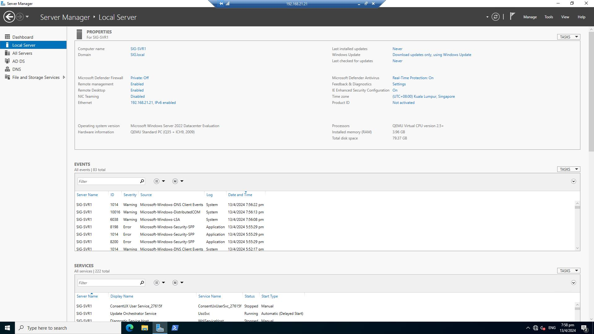
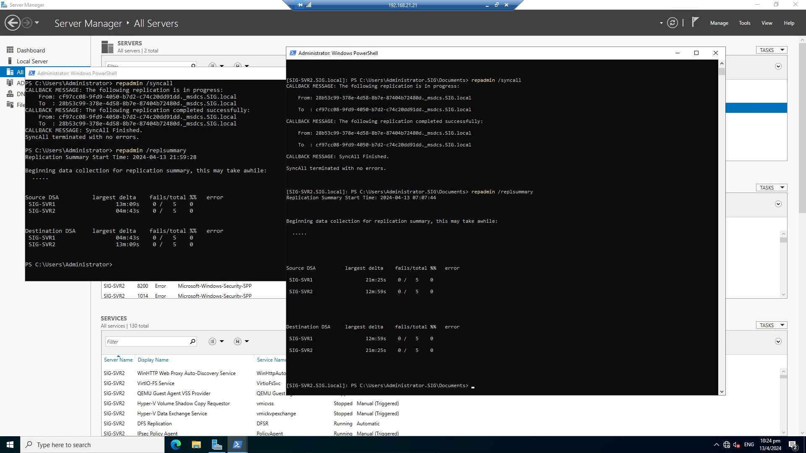

# Windows Server 2022 Lab

## Table of Contents

- [Windows Server 2022 Lab](#windows-server-2022-lab)
  - [Table of Contents](#table-of-contents)
  - [Introduction](#introduction)
  - [Network Diagram](#network-diagram)
    - [Virtual Network](#virtual-network)
    - [SIG Network](#sig-network)
    - [MYN Network](#myn-network)
  - [Projects List](#projects-list)
  - [Setup PFSENSE as router for all networks](#setup-pfsense-as-router-for-all-networks)
  - [Setup base VM of Windows Server 2022 to clone](#setup-base-vm-of-windows-server-2022-to-clone)
  - [Setup SIG-SVR1 as Domain Controller](#setup-sig-svr1-as-domain-controller)
    - [Setup SIG-SVR1 VM](#setup-sig-svr1-vm)
    - [Setup SIG-SVR1 as Domain Controller](#setup-sig-svr1-as-domain-controller-1)
  - [Setup SIG-SVR2 as Secondary Domain Controller on Server Core](#setup-sig-svr2-as-secondary-domain-controller-on-server-core)
    - [Deploy Windows Server 2022 Core VM](#deploy-windows-server-2022-core-vm)
    - [Setup SIG-SVR2 as Secondary Domain Controller](#setup-sig-svr2-as-secondary-domain-controller)
  - [Test AD Replication](#test-ad-replication)
  - [Implement SIG-SVR1 And SIG-SVR2 to serve DNS](#implement-sig-svr1-and-sig-svr2-to-serve-dns)

## Introduction

## Network Diagram

### Virtual Network
---


### SIG Network

| Network | Hostname | IP Address| Description |
| --- | --- | --- | --- |
| SIG.local | SIG-SVR1 | 192.168.21.21 | DC, DNS and DHCP |
| SIG.local | SIG-SVR2 | 192.168.21.22 | DC, DNS and DHCP |
| SIG.local | SIG-SVR3 | 192.168.21.23 | DFS File Server |
| SIG.local | SIG-SVR4 | 192.168.21.24 | DFS File Server |
| SIG.local | SIG-SVR5 | 192.168.22.21 | RODC for Branch |
| SIG.local | SIG-PCn | 192.168.23.0/24 | SIG Client |

### MYN Network

| Network | Hostname | IP Address| Description |
| --- | --- | --- | --- |
| MYN.local | MYN-SVR1 | 192.168.24.2 | DC, DNS and DHCP |
| MYN.local | MYN-SVR2 | 192.168.24.3 | RODC |

## Projects List

- [x] Setup PFSENSE as router for all networks
- [x] Setup base VM of Windows Server 2022 to clone
- [x] Setup SIG-SVR1 as Domain Controller
- [x] Setup SIG-SVR2 as Secondary Domain Controller on Server Core
- [x] Test AD Replication
- [ ] Implement SIG-SVR1 And SIG-SVR2 to serve DNS
- [ ] Implement SIG-SVR1 to serve DHCP and SIG-SVR2 as failover DHCP
- [ ] Enable DHCP Relay on PFSENSE interfaces
- [ ] Create OUs, Users and Groups
- [ ] Setup Group Policies
  - [ ] Standard GPO for HO-Computer
    - [ ] Password Policy
    - [ ] Account Lockout policy
    - [ ] Machine Inactivity Logon
  - [ ] 


## Setup PFSENSE as router for all networks

PFSENSE Firewall is used as router for all networks.


Initially, any traffic from WAN to all LANs is blocked.


Allow all traffic between all LANs especially for WDS.


## Setup base VM of Windows Server 2022 to clone

As Proxmox is hypervisor, Virtio-win drivers are installed on Base VM.

A sysprep shortcut is also created on desktop for sysprepping and cloning.


After setting up some settings such as disabling Firewall, enabling Remote Desktop, setting up timezone, VM is shutdown.


## Setup SIG-SVR1 as Domain Controller

### Setup SIG-SVR1 VM

SIG-SVR1 VM is cloned from Windows 11 VM.

After cloning process is completed, sysprep is performed.

Below will be setup using PowerShell.

* Hostname        - SIG-SVR1
* IP Address      - 192.168.21.21
* Default Gateway - 192.168.21.1
* DNS Servers     - 192.168.21.21,192.168.21.22

Powershell command for setting up static IP address.

```
New-NetIPAddress -IPAddress 192.168.21.21 -PrefixLength 24 -DefaultGateway 192.168.21.1 -InterfaceIndex (Get-NetAdapter).InterfaceIndex
```

192.168.21.21 and 192.168.21.22 IP addresses will be for SIG-SVR1 and SIG-SVR2 which will be domain controllers.

Those addresses will be put as DNS server.

```
Set-DnsClientServerAddress -InterfaceIndex (Get-NetAdapter).InterfaceIndex -ServerAddresses ("192.168.21.21","192.168.21.22")
```

Now setup SIG-SVR1 as computer name.

```
Rename-Computer -NewName SIG-SVR1 -Restart
```

SIG-SVR1 is connected through Remote Desktop.

### Setup SIG-SVR1 as Domain Controller

Install ADDS Service using powershell

```
Install-WindowsFeature -name AD-Domain-Services -IncludeManagementTools
```

Import ADDSDeployment Module using below command

```
Import-Module ADDSDeployment
```

Promote Domain Controller using PowerShell

```
Install-ADDSForest -CreateDnsDelegation:$false -DatabasePath "C:\Windows\NTDS" -DomainMode "WinThreshold" -DomainName "SIG.local" -DomainNetbiosName "SIG" -ForestMode "WinThreshold" -InstallDns:$true -LogPath "C:\Windows\NTDS" -NoRebootOnCompletion:$false -SysvolPath "C:\Windows\SYSVOL" -Force:$true
```




## Setup SIG-SVR2 as Secondary Domain Controller on Server Core

### Deploy Windows Server 2022 Core VM

Set IP Address

```
New-NetIPAddress -IPAddress 192.168.21.22 -PrefixLength 24 -DefaultGateway 192.168.21.1 -InterfaceIndex (Get-NetAdapter).InterfaceIndex
```


Set DNS Server Addresses

```
Set-DnsClientServerAddress -InterfaceIndex (Get-NetAdapter).InterfaceIndex -ServerAddresses ("192.168.21.22","192.168.21.21")
```


Set SIG-SVR2 as Hostname


Disable Firewall

```
Set-NetFirewallProfile -Profile Domain, Public, Private -Enabled False
```


### Setup SIG-SVR2 as Secondary Domain Controller

Install ADDS Service using powershell

```
Install-WindowsFeature -name AD-Domain-Services -IncludeManagementTools
```

Import ADDSDeployment Module using below command

```
Import-Module ADDSDeployment
```

Promote Domain Controller using PowerShell

```
Install-ADDSDomainController -NoGlobalCatalog:$false -CreateDnsDelegation:$false -Credential (Get-Credential) -CriticalReplicationOnly:$false -DatabasePath "C:\Windows\NTDS" -DomainName "SIG.local" -InstallDns:$true -LogPath "C:\Windows\NTDS" -NoRebootOnCompletion:$false -SiteName "Default-First-Site-Name" -SysvolPath "C:\Windows\SYSVOL" -Force:$true
```


## Test AD Replication

SIG-SVR2 is added in Server Manager of SIG-SVR1 to manage remotely from SIG-SVR1.


Open PowerShell on both servers and run repadmin /syncall, repadmin /replsummary and repadmin /showrepl.




## Implement SIG-SVR1 And SIG-SVR2 to serve DNS

Check DNS by using nslookup.


Name can be resolved but IP cannot be resolved.

That is because DNS Reverse Lookup Zone is not created yet.


In my lab, there are two DNS entries in DNS Manager. It is because DNS server role is installed after ADDS Server is installed.

For more information, see [here](https://learn.microsoft.com/en-us/answers/questions/222309/double-dns-server-entry-showing-in-dns-manager-in).

